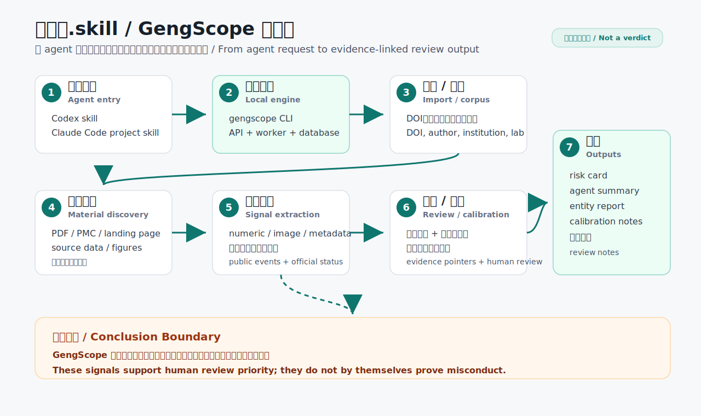
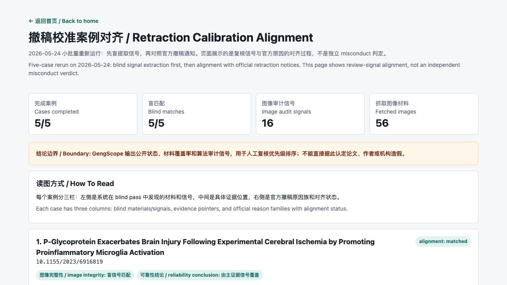

# GengScope / 耿同学.skill

中文说明：[README.md](README.md).

### Project Positioning

GengScope is an evidence-linked research integrity indexing platform for public papers involving Chinese research institutions.

GengScope is not designed to decide whether a paper is fraudulent. Its first goal is to build a searchable, traceable and correctable evidence index that connects papers, authors, institutions, laboratories, journals, public discussions, official actions, algorithmic review signals and evidence locations in one structured system.

The product direction is entity-driven: start from an author, institution, laboratory or local entity list; build the paper corpus for that entity; discover auditable materials such as PDFs, supplementary files and source data; then generate entity-level coverage, review queues and risk cards. DOI is a paper identifier, not the only entry point.

The Chinese display name for the skill is `耿同学.skill`; the English package, trigger name and CLI remain `gengscope`. Public communication should state clearly that this is an independent tool and does not represent any person or third-party official authorization.

### Product Scope

The first version focuses on life science, medicine, biomaterials and nanomedicine papers published since 2020 with participation from mainland Chinese institutions.

The platform answers five questions:

- What public risk signals are linked to a paper?
- Which papers, events and official statuses are linked to an author or institution?
- How much of an author, laboratory or institution corpus has auditable material?
- Can a public concern be traced to a specific figure, table, source data file or supplementary file?
- Can Codex, Claude Code or another agent query the local HTTP API and produce a reviewable audit summary?

### Quick Use: Codex / Claude Code

The fastest path is to start the GengScope engine first, then let Codex or Claude Code call the same local CLI/API. `耿同学.skill` is the workflow entrypoint; the actual import, material discovery, audit and report generation are handled by the GengScope API, worker, database and CLI in this repository.

1. Clone the repository and start the local engine:

```bash
git clone https://github.com/leiMizzou/gengscope.git
cd gengscope
cp infra/docker/.env.example infra/docker/.env
docker compose -f infra/docker/docker-compose.yml up -d --build api worker
```

2. Install the skill for Codex:

```bash
mkdir -p ~/.codex/skills
cp -R skills/gengscope ~/.codex/skills/gengscope
```

Then ask Codex:

```text
Use 耿同学.skill to inspect this DOI: 10.xxxx/example
Use gengscope to build a corpus and generate a risk summary for this institution: Tsinghua University
```

3. Use the project skill in Claude Code:

This repository includes `.claude/skills/gengscope/SKILL.md`. Open Claude Code at the repository root and run:

```text
/gengscope inspect this DOI: 10.xxxx/example
/gengscope build a corpus and generate a risk summary for this institution: Tsinghua University
```

Codex and Claude Code use different entrypoints, but both call the `gengscope` CLI or the local API at `http://127.0.0.1:8010/`. A remote agent cannot access `127.0.0.1` on your laptop; to use GengScope remotely, deploy the API where that agent can reach it and configure a read-only or restricted API key.

The automated workflow can handle DOI import, author/institution search, corpus builds, material discovery, numeric/image/metadata audits, risk cards, agent summaries, entity reports, retraction calibration, review notes and archived reports. Human confirmation is still required for author/institution disambiguation, paywalled or private materials, and any misconduct-level conclusion.



See [Workflow Overview](docs/workflow-overview.md) for a concise visual explanation.

### Core Boundary

Unless a journal, institution, regulator or author has publicly confirmed an issue, no paper should be labeled as "fraudulent". The platform only uses tiered status labels:

- `official_retraction`
- `official_correction`
- `official_expression_of_concern`
- `institution_investigation`
- `institution_conclusion`
- `public_discussion`
- `media_report`
- `algorithmic_signal`
- `manual_review_needed`

### Repository Layout

```text
apps/
  web/                 Web product frontend
services/
  api/                 Backend API
  worker/              Data collection, cleaning and audit jobs
packages/
  shared-schema/       JSON Schema / OpenAPI / TypeScript types
data/
  seeds/               Small committed seed data
  samples/             Small test samples; no large files
skills/
  gengscope/           Publishable Codex/GPT workflow skill
infra/
  docker/              Local development dependencies
  migrations/          Database migrations
scripts/
  ingest/              Command-line ingest scripts
docs/
  product-design.md
  technical-plan.md
  data-model.md
  roadmap.md
  skill-integration.md
  governance.md
```

### Documentation

- [Product Design](docs/product-design.md)
- [Entity-Driven System Design](docs/entity-driven-system.md)
- [Technical Plan](docs/technical-plan.md)
- [Data Model](docs/data-model.md)
- [API Contract](docs/api-contract.md)
- [Implementation Plan](docs/implementation-plan.md)
- [Seed Cases](docs/seed-cases.md)
- [Roadmap](docs/roadmap.md)
- [Skill Integration](docs/skill-integration.md)
- [耿同学.skill Case Demo](docs/skill-case-demo.md)
- [Workflow Overview](docs/workflow-overview.md)
- [Retraction Calibration](docs/retraction-calibration.md)
- [Governance](docs/governance.md)

### Run The Current MVP

The current runnable slice is a local HTTP API and same-port workbench, not an MCP server.

```bash
cd services/api
python3 -m venv .venv
. .venv/bin/activate
python -m pip install -e . pytest
gengscope serve --reload
```

Open:

```text
http://127.0.0.1:8000/
http://127.0.0.1:8000/docs
```

Docker Compose from the repo root:

```bash
cp infra/docker/.env.example infra/docker/.env
docker compose -f infra/docker/docker-compose.yml up --build api worker
```

Docker exposes the API on `http://127.0.0.1:8010/` by default. Override with `GENGSCOPE_API_PORT=8000` if that port is free. The compose stack waits for PostgreSQL readiness, exposes `/health/ready` for database, migration and artifact-volume checks, runs a background worker, and stores uploaded artifacts in the `gengscope_artifacts` Docker volume.

The installed CLI is the local automation surface used by skills, CI and shell users:

```bash
gengscope health --base-url http://127.0.0.1:8010
gengscope search "Tsinghua University" --entity-type institution --base-url http://127.0.0.1:8010
gengscope import-doi "10.1038/s41586-024-08248-5" --base-url http://127.0.0.1:8010
gengscope agent-summary "10.1038/s41586-024-08248-5" --base-url http://127.0.0.1:8010
```

For daily use, open the Workbench first. Search an author or institution, choose the right candidate card, then either build the corpus immediately or queue "background corpus build" so the browser does not wait on OpenAlex and Crossref. Entity search results are persisted in `entity_search_cache`; once a query has been served by OpenAlex, repeated searches with the same query return from the local database and the response reports whether the result is `cached`, `stale` or freshly `refreshed`. Add `refresh=true` to `/api/entities/search` when you explicitly want a live OpenAlex refresh.

After building an institution corpus, use `GET /api/entities/institution/<id>/breakdown` or the Workbench breakdown action to group raw affiliations into likely schools, departments, institutes, laboratories and author clusters. This is deliberately heuristic and review-oriented; it helps decide where to expand audit coverage, not assign definitive administrative responsibility.

Back up and restore the local PostgreSQL database:

```bash
scripts/db_migrate.sh
scripts/db_backup.sh
GENGSCOPE_ALLOW_RESTORE=1 scripts/db_restore.sh backups/gengscope_YYYYMMDD_HHMMSS.sql
```

### First Engineering Target

Build an entity-driven local API MVP:

1. Search authors and institutions through OpenAlex.
2. Build a local corpus for an author or institution.
3. Build corpora in batches from a local entity list.
4. Import CSV/TSV/JSON entity manifests for local entity lists.
5. Create local group/lab entities from multiple resolved authors and institutions.
6. Track paper material status: metadata only, landing page, PDF, source data or fully auditable.
7. Generate entity-level coverage and risk profiles.
8. Add small-sample inference boundaries so high signal density raises review priority without implying full-corpus misconduct.
9. Queue auditable papers for review.
10. Discover PMC/landing-page and publisher-specific material links, then upload, register or HTTP-fetch source data, PDF and image artifacts into local storage.
11. Run numeric, image and metadata audit checks and write algorithmic signals with evidence pointers.
12. Detect whole-image, flip/rotation and local crop/patch image similarity in the first deterministic image analyzer.
13. Maintain deterministic, review-labeled golden regression cases for numeric, image and metadata analyzers.
14. Browse signals globally or by author/institution/group.
15. Review signals as confirmed, false positive, not actionable or needing more evidence.
16. Generate neutral paper and entity risk cards.
17. Export and archive entity reports as reproducible JSON/Markdown snapshots.
18. Record audit logs for corpus builds, artifact operations, audit runs, report exports, report archives, job runs and review decisions.
19. Queue single or batch entity audit jobs, or recurring entity audit schedules, and process them with a deployable background worker.
20. Cache entity search candidates locally and expose a background corpus-build job so large entity workflows feel fast and inspectable.
21. Protect `/api/*` with optional local API keys and simple read/reviewer/admin roles when deployed outside a trusted local shell.
22. Preserve the conclusion boundary: signals prioritize review, they do not prove misconduct.

### Verification

Run the local verification script from the repo root:

```bash
scripts/verify_local.sh
```

Set `GENGSCOPE_VERIFY_DOCKER_BUILD=1` to include Docker API and worker image builds. The GitHub Actions workflow in `.github/workflows/gengscope-api-ci.yml` runs offline tests, the PostgreSQL integration loop, Docker image builds and the deploy smoke test.

Run the deploy smoke test from the repo root when you want to verify the Docker stack end to end:

```bash
scripts/verify_deploy.sh
```

The deploy smoke test seeds deterministic synthetic demo records inside the Docker database and exercises the deployed API path for entity profile, artifact upload, numeric audit, review decision, report archive, job execution and recurring schedule creation. Remote artifact fetching refuses private, loopback and link-local network targets by default; set `ARTIFACT_FETCH_ALLOW_PRIVATE_NETWORKS=1` only for a trusted private mirror. Use `ARTIFACT_FETCH_MIN_INTERVAL_SECONDS` to add a per-host delay for polite publisher downloads.

### Skill And Public Demo

The publishable skill is in `skills/gengscope`. Its English package and trigger name is `gengscope`; its Chinese display name is `耿同学.skill`.

It is intentionally a thin workflow entrypoint: it tells an AI agent how to call the local GengScope CLI/API, how to preserve evidence boundaries, and how to summarize DOI/entity risk signals without making misconduct claims.

Validate the skill package:

```bash
scripts/validate_skill.py skills/gengscope
```

Run a lightweight public-demo stack with synthetic records and a read-only demo key:

```bash
scripts/verify_demo_publish.sh
```

The demo stack uses `infra/docker/docker-compose.demo.yml`, seeds `10.5555/gengscope.demo.1`, and verifies that `demo-read` can read the agent summary but cannot write admin events. For public exposure, keep write/admin keys private and publish only a read key for browsing demo data.

Static public demo:

```text
https://leimizzou.github.io/gengscope/demo/
```

Run a local synthetic case demo that simulates Codex using `耿同学.skill` against the local engine and prints the numeric/image review signals:

```bash
python3 scripts/run_skill_case_demo.py --base-url http://127.0.0.1:8010
```

Build a source bundle for a release page:

```bash
scripts/build_release_bundle.sh
```

Run a public, source-attributed real-case smoke against a running local API:

```bash
scripts/run_real_case_e2e.py --base-url http://127.0.0.1:8010
```

This imports a real retracted article, records the publisher notice as an official event, discovers linked material records, and reports the connected authors, institution and affiliation breakdown. It should be used as an end-to-end workflow check, not as an independent misconduct determination.

### Retraction Calibration

Run the retrospective calibration workflow when you want to compare blind GengScope signals against official retraction reasons:

```bash
python3 scripts/run_retraction_calibration.py --base-url http://127.0.0.1:8010 --limit 5
```

Latest five-case rerun: 5/5 cases completed, and 5/5 had at least one blind signal family aligned with the official retraction reason. The alignment demo shows each paper's blind signal, evidence file/region pointer, official reason and alignment status.



Classic alignment examples:

| DOI | Blind signal | Evidence pointer | Official retraction reason | Alignment result |
| --- | --- | --- | --- | --- |
| `10.1155/2023/6916819` | image internal patch similarity | `OMCL2023-6916819.003.jpg`, `g6:r1c0 -> g6:r2c0`, `hamming=0`, `transform=original` | Official notice reports image/data overlap or duplication across multiple figures and reliability concerns | image integrity matched by blind signal; reliability covered by primary evidence signal |
| `10.1155/2021/4704771` | image internal patch similarity | `OMCL2021-4704771.001.jpg`, `g4:r2c0 -> g4:r2c3`, `hamming=0`, `transform=flip_horizontal` | Official notice reports duplicated Figure 2 panels, Figure 1 overlap, incorrect Table 2 primer information and unreliable conclusions | image integrity matched by blind signal; table/primer issue is an unsupported analyzer family |
| `10.1113/EP091162` | image internal patch similarity | `EPH-108-1215-g007.jpg`, `g5:r2c2 -> g5:r2c3`, `hamming=0`, `transform=original` | Official notice reports figure tissue-identity concerns, unavailable original IHC slides, histology/magnification inconsistency and reliability concerns | image integrity matched by blind signal; raw data/IHC materials remain a material gap |

These examples show alignment between blind signals and official reason families. They are not independent misconduct determinations.

Open the interactive page: [Retraction Calibration Alignment](docs/retraction-calibration-demo.html).

See [Retraction Calibration](docs/retraction-calibration.md) for details.
