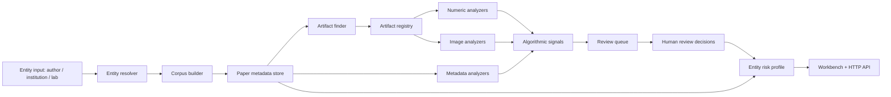

# Entity-Driven System Design

GengScope 的核心入口应该是作者、机构、实验室和研究团队，而不是 DOI。DOI 仍然重要，但它只是论文对象的稳定标识之一，不应该成为产品的唯一入口。

更合理的目标形态是：给定一个作者、机构、实验室名称、OpenAlex/ROR/ORCID 标识或一批本地名单，系统先建立这个实体的论文全库，再尽可能寻找每篇论文的可审计材料，最后用算法和人工复核生成实体级风险画像。

## 1. Product Shape

终局产品应是一个本地或私有部署的 HTTP API + 审计工作台，而不是 MCP server。

```text
Local/API users
  -> FastAPI service
  -> optional API key gate
  -> PostgreSQL
  -> worker queue
  -> artifact storage
  -> review workbench
```

MCP 或 Codex skill 可以作为后续调用层，但不应该是核心服务形态。核心服务应该能被 curl、Python 脚本、CI、网页、notebook 和 agent 统一调用。

第一屏应该是 workbench：

- 搜作者或机构。
- 用候选卡片做消歧，并显示搜索结果来自实时 OpenAlex 还是本地缓存。
- 构建本地论文库。
- 对慢任务使用后台建库 job，而不是让浏览器阻塞等待网络请求。
- 查看已找到多少论文、多少有 PDF、多少有 source data、多少进入审计。
- 一键生成审查队列。
- 查看实体级风险画像和每篇论文证据。

## 2. Core Loop

### Step 1: Entity Discovery

输入可以是：

- 作者名。
- 机构名。
- 实验室名。
- OpenAlex author ID。
- OpenAlex institution ID。
- ORCID。
- ROR ID。
- 本地 CSV 名单。

系统先返回候选实体，避免同名作者误合并。作者消歧必须保守：没有 ORCID、OpenAlex author ID、稳定机构轨迹或人工确认时，不要强行合并。

搜索候选实体时应该默认优先走本地缓存。第一次命中 OpenAlex 后，将 `entity_type + query_normalized + limit` 的候选列表写入 `entity_search_cache`；后续相同搜索直接从数据库返回，并明确标注 `fresh`、`stale` 或 `refreshed`。这样 Workbench 的常用入口是秒级响应，真正慢的外部网络只在首次搜索或 `refresh=true` 时发生。

### Step 2: Corpus Build

系统围绕实体构建论文集合：

- 从 OpenAlex 拉取该作者或机构的 works。
- 用 Crossref / PubMed / Europe PMC 补充 DOI、PMID、PMCID、期刊、年份。
- 保留原始 affiliation 和 source payload。
- 用原始 affiliation 生成机构内的启发式 breakdown，例如学院、系、研究院、实验室、医院、中心和作者群。
- 对每篇论文标记材料状态。

材料状态建议分层：

```text
metadata_only
landing_page_found
pdf_found
source_data_found
full_auditable
manual_upload_available
```

这一步的目标不是完美全文覆盖，而是先知道“全库有多大”和“可审计样本有多大”。

### Step 3: Artifact Discovery

对每篇论文尝试寻找可审计材料：

- open access PDF。
- PubMed Central full text。
- publisher supplementary files。
- source data XLSX/CSV。
- figure images。
- correction/retraction notice。
- 手工上传文件。

每个文件都进入 artifact registry，保存：

- source URL。
- content type。
- checksum。
- captured time。
- license / access status。
- local storage URI。

不要把“找不到全文”当成失败。系统应该明确展示覆盖率：比如 10 篇论文中 3 篇有可审计材料，这 3 篇就是当前可分析样本。

### Step 4: Algorithmic Audit

算法审计分三类。

数值审计：

- source data 末位数字分布。
- 重复数列。
- 异常小方差。
- 组间固定差值或固定比例。
- 不合理高相关。
- 重复 biological replicate。

图像审计：

- panel 感知哈希重复。
- crop / flip / rotate 重复。
- 局部 patch 相似。
- 对比度调整后的重复。
- 跨图复用。

元数据审计：

- 异常高产集群。
- 同一作者/机构周围的撤稿、更正、公开质疑密度。
- 高度模板化标题或异常协作网络。
- 同期同刊异常集中。

算法输出只能叫 `algorithmic_signal`，不能直接叫 fraud。每条信号必须有 evidence pointer，能指回具体文件、图、表、列、坐标或截图。

### Step 5: Human Review

AI 或算法发现的内容进入 review queue：

- reviewer 判断 false positive / needs more evidence / confirmed signal。
- confirmed signal 仍然不是官方造假结论。
- 只有官方来源才能产生 retraction、correction、expression of concern、institution conclusion 等状态。

这个环节是法律和科研伦理边界的核心。

### Step 6: Entity Profile

最终系统输出的不是“这个人造假”，而是实体级审计画像：

```json
{
  "paper_count": 10,
  "auditable_paper_count": 3,
  "audited_paper_count": 3,
  "signal_paper_count": 2,
  "official_event_count": 0,
  "public_discussion_count": 1,
  "auditable_coverage": 0.3,
  "audit_coverage": 1.0,
  "signal_rate_among_audited": 0.667,
  "priority": "high",
  "conclusion_boundary": "只能说明已审计样本中存在较高异常信号密度，不能直接认定全部论文或作者造假。"
}
```

这和你描述的思路一致：如果 10 篇里只能找到 3 篇全文，而这 3 篇里 2 篇有强异常，系统应该把这个实体提升为高优先级审计对象。但不能直接推出剩下 7 篇一定有问题，只能说“已审计样本中的信号密度很高，值得扩大材料获取和人工复核”。

## 3. Sampling And Inference Boundary

小样本可以用于优先级排序，不能用于定性判决。

推荐实体画像同时展示三组数字：

- coverage：全库中有多少论文找到了可审计材料。
- hit rate：已审计样本中多少论文出现算法或人工确认信号。
- confidence boundary：样本太小时，结论必须降级表达。

例如：

```text
全库 10 篇，可审计 3 篇，已审计 3 篇，其中 2 篇出现高强度算法信号。
系统判断：high priority for expanded audit。
禁止判断：该作者 10 篇论文大概率全部造假。
```

后续可以用简单贝叶斯估计或 Wilson 区间给出不确定性，但产品文案仍应保持保守。统计模型负责排序，不负责定罪。

## 4. Recommended Architecture



Service split:

- `api`: HTTP API、实体画像、风险卡、review queue、job queue、workbench。
- `worker`: 从 `job_runs` 读取任务，执行材料发现、PDF/source data 解析、算法审计。
- `db`: PostgreSQL，保存元数据、事件、信号、review tasks。
- `storage`: 本地目录或 S3/R2/MinIO，保存允许保存的材料和分析产物。
- `ui`: 初期可以直接内嵌在 API，后期再拆成 Next.js。

## 5. API Surface

当前 MVP 应优先稳定这些接口：

```text
GET  /api/entities/search
POST /api/entities/corpus
POST /api/entities/corpus/batch
POST /api/entities/corpus/import
POST /api/entities/groups
POST /api/entities/groups/corpus
GET  /api/entities/{entity_type}/{entity_id}/profile
GET  /api/entities/{entity_type}/{entity_id}/breakdown
POST /api/entities/review-queue
POST /api/artifacts/register
POST /api/artifacts/upload
POST /api/artifacts/discover
POST /api/artifacts/fetch
GET  /api/artifacts/papers/{paper_id}
POST /api/audits/numeric
POST /api/audits/image
POST /api/audits/metadata
POST /api/audits/entity-cycle
GET  /api/signals
GET  /api/entities/{entity_type}/{entity_id}/signals
GET  /api/reports/entity
POST /api/reports/entity/archive
GET  /api/reports/archive
POST /api/reports/archive/prune
GET  /api/reports/archive/{snapshot_id}
GET  /api/review/tasks
POST /api/review/tasks/{id}/decision
GET  /api/audit-log
GET  /api/jobs
POST /api/jobs/entity-corpus
POST /api/jobs/entity-cycle
POST /api/jobs/entity-cycle/batch
GET  /api/jobs/schedules
POST /api/jobs/schedules/entity-cycle
POST /api/jobs/schedules/run-due
POST /api/jobs/schedules/{schedule_id}/status
GET  /api/jobs/{job_id}
POST /api/jobs/{job_id}/run
POST /api/jobs/{job_id}/retry
GET  /api/papers/{doi}
GET  /api/papers/{doi}/risk-card
```

下一阶段应该增加：

```text
POST /api/audits/image/patch-similarity
POST /api/audits/title-template
```

这些接口让系统成为本地可调用 API：CI、脚本、网页和 agent 都能围绕同一个服务跑，不需要依赖 MCP。慢路径应该进入 job queue，例如 `POST /api/jobs/entity-corpus` 负责后台建库，`POST /api/jobs/entity-cycle` 负责后台发现材料、排队和元数据审计。

## 6. Testing Strategy

完整测试应该分层：

1. Offline unit tests：不联网，用 fake OpenAlex/Crossref，验证实体搜索、建库、画像、risk card。
2. PostgreSQL integration tests：用 docker PostgreSQL 跑完整 HTTP loop。
3. Live metadata smoke tests：少量真实 OpenAlex/Crossref 请求，验证上游兼容性。
4. Artifact fixture tests：用本地 PDF/XLSX/CSV/图片样本验证解析和 analyzer。
5. Browser/workbench tests：打开本地页面，验证能搜索、显示候选卡片、区分缓存/实时状态、建库和后台建库排队。
6. Audit-log/security tests：验证写入动作能记录 actor，配置 API key 后 `/api/*` 会拒绝未授权请求。
7. CI tests：`scripts/verify_local.sh` 和 GitHub Actions 跑离线测试、PostgreSQL 回路与 Docker Compose config。
8. Regression golden cases：保存一批已知人工结果，防止算法输出漂移。

当前代码已经覆盖这 8 类的基础路径，包括 metadata analyzer、机构 affiliation breakdown、信号浏览、实体报告导出与归档、报告归档保留/清理、可选 API key 和 read/reviewer/admin 角色、操作审计日志、后台 job queue、周期性 entity audit schedule、基础图像局部相似检测、publisher-aware URL artifact discovery/fetch、远程抓取 SSRF 防护、fetchable license 校验、HTML 误下载拒绝、可配置下载节流、批量实体入口、CSV/TSV/JSON 实体名单导入、本地 group/lab 组合实体、可重复部署 E2E smoke、公开真实案例 smoke，以及带正例/负例/局部复用语义的 numeric/image/metadata deterministic golden regression cases。下一步最该补真实人工标注样本、更多 publisher 下载许可策略和 PDF/HTML 图像面板抽取。

## 7. Next Engineering Target

artifact + numeric/image/metadata audit 最小闭环已经具备：

1. `source_artifacts` 的已知 URL 发现、PMC/landing page 链接解析、登记、上传和 HTTP/HTTPS fetch 接口。
2. CSV/TSV/XLSX source data 解析。
3. 第一个 numeric analyzer：重复数列 + 末位数字异常。
4. analyzer 结果写入 `algorithmic_signals` 和 `evidence_pointers`。
5. 图片相似审计：重复、翻转、旋转、裁剪和局部 patch 相似的基础检测。
6. 元数据审计：发表年份聚集、期刊聚集、标题模板相似、公开事件密度、非元数据算法信号密度。
7. 实体级 signal browser：按作者/机构查看全部信号和人工复核状态。
8. workbench 支持 review tasks 列表和人工 decision。
9. 操作审计日志：记录建库、材料、审计、报告和复核动作。
10. 可选 API key：部署到非完全可信本地环境时保护 `/api/*`。
11. 同步实体审计 cycle：单次 API 调用串联材料发现、复核排队和元数据审计。
12. 持久化 job queue + `gengscope-worker`：把实体审计 cycle 放入后台执行并查询状态，worker 使用数据库行锁领取任务并支持 stale job 恢复。
13. 实体画像的 `sample_inference`：展示已审计样本的信号率、Wilson 置信区间和不可外推边界。
14. 批量实体建库和批量实体审计任务入队，支持本地名单驱动的全库扫描。

下一步应该补生产级使用能力：

1. 扩展材料发现：更多 publisher supplementary/source data 适配器和字段级许可策略。
2. 增加更强图像审计：多尺度 patch、对比度/亮度调整、局部遮挡鲁棒性和真实人工标注 golden set。
3. 扩大批量实体名单文件导入、定时 job 和报告归档自动保留策略的生产样本覆盖。
4. 增加更细的角色权限、材料自动下载策略和备份保留策略。
